# 📊 WhatsApp Integration - Visual Architecture Diagrams

## 🏗️ System Architecture Overview

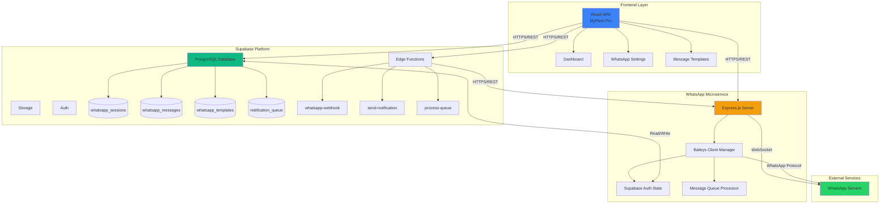

## 🔄 Session Initialization Flow

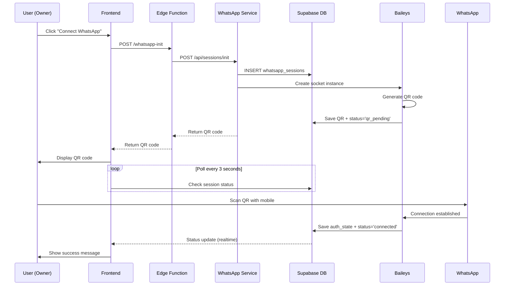

## 📨 Message Sending Flow

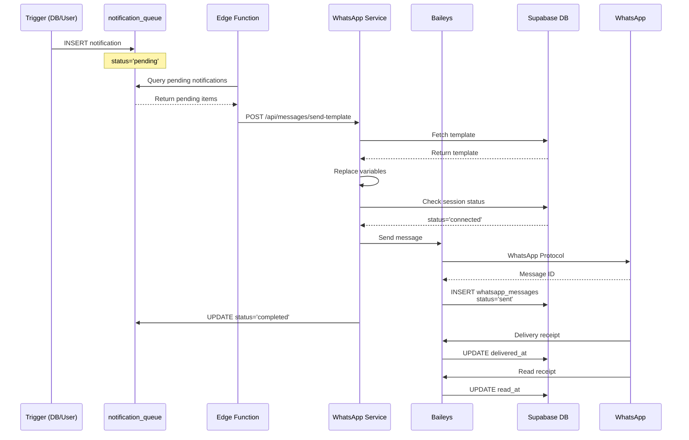

## 🗄️ Database Schema

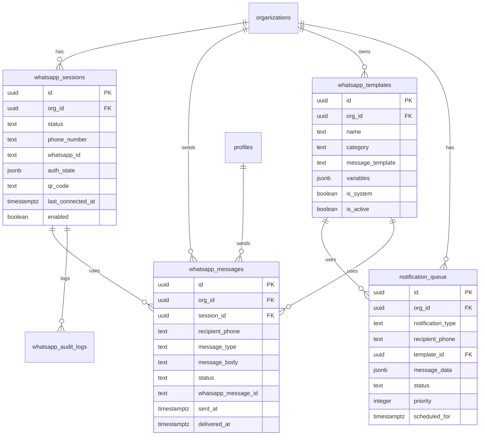

## 🔐 Security Architecture

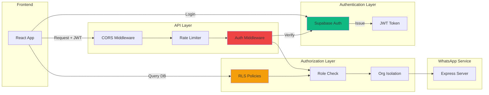

## 📊 Data Flow - Trial User Welcome

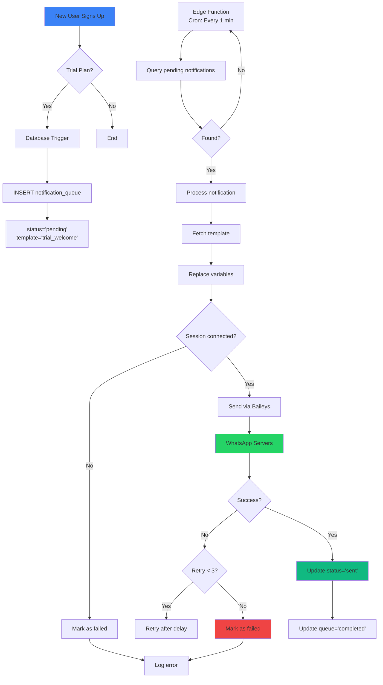

## 🔄 Multi-Tenant Session Management

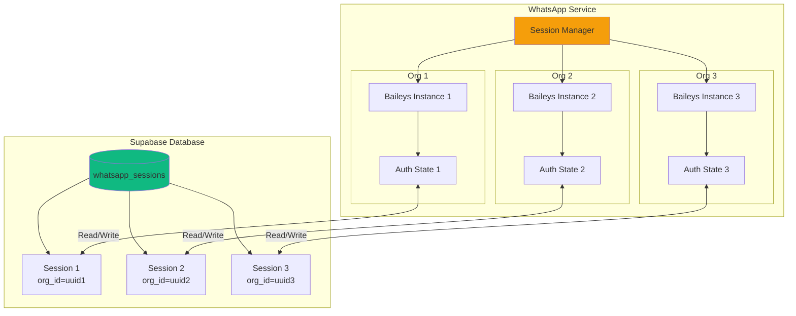

## 🚀 Deployment Architecture

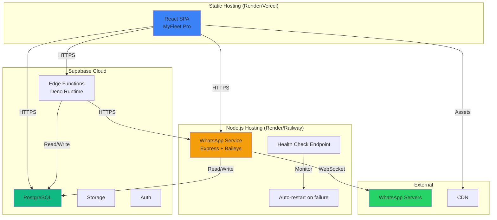

## 📈 Scaling Strategy

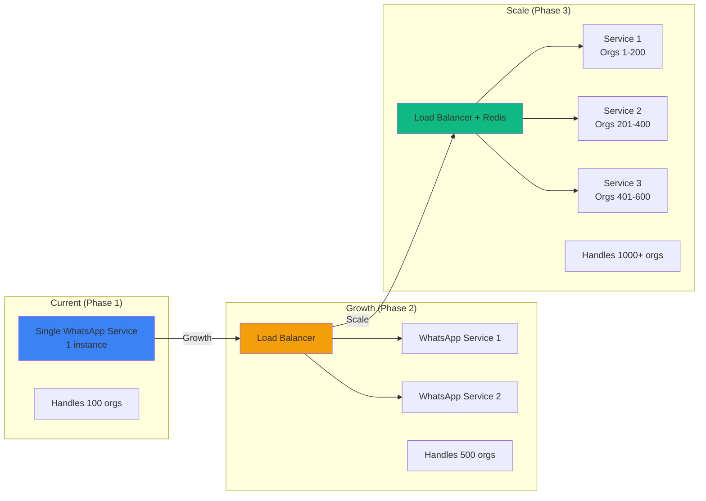

## 🔧 useSupabaseAuthState Implementation

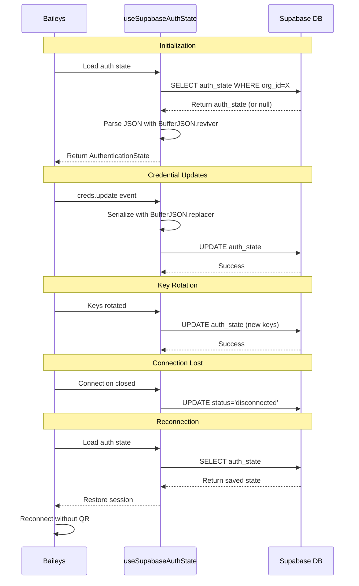

## 📱 Frontend Component Structure

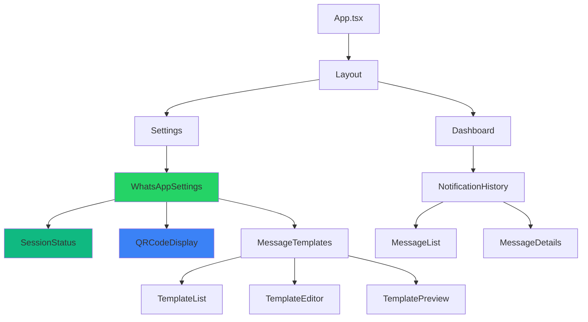

---

## 📝 Legend

- 🔵 **Blue**: Frontend/Client-side
- 🟢 **Green**: Database/Storage
- 🟠 **Orange**: Backend Services
- 🟢 **WhatsApp Green**: WhatsApp-related components

---

**Created**: 2026-02-07  
**Version**: 1.0
